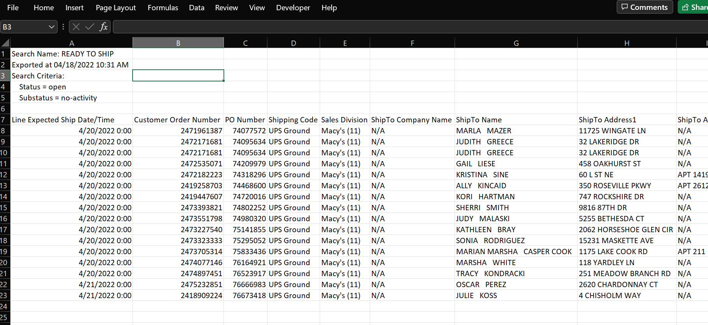
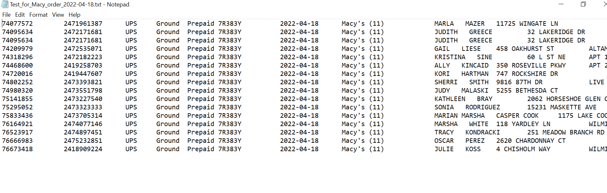

# CommerceHub :convenience_store:
Taking CommerceHub Macy's Orders and formatting them for 3PL Central

[Order Input](macys_csv_4.18.22.csv)




```python

# Take orders from CommerceHub and send to 3PL Central
# Take orders from a .csv.  Transform columns and drop unnecessary ones.
# Need to set up API calls on the GET from CommerceHub and POST to 3PL Central end to fully automate.

import pandas as pd
import numpy as np
from datetime import date

today = date.today()
# print("Today's date:", today)

orders = pd.read_csv(f'macys_{today}.csv', skiprows=6)
orders['Shipping Code']= orders['Shipping Code'].str.split()
orders['ShipCarrier'] = orders['Shipping Code'][0][0]
orders['ShipService'] = orders['Shipping Code'][0][1]
orders = orders.drop(['Line Expected Ship Date/Time',
                     'ShipTo Company Name', 'ShipTo Postal Code Ext', 'Shipping Code'], axis=1)

# Keep these columns or at least the data underneath and put them into text tab delimited format (template).
template = pd.read_excel('Order Import Template.xlsx', skiprows=1)
column_list = template.columns.to_list()

len(orders)

orders.columns.to_list()
```

[Order Output](Test_for_Macy_order_2022-04-18.txt)




```python

# Create empty file shaped with template columns and orders rows.

d = pd.DataFrame("", index=np.arange(len(orders)), columns=column_list)

d[['ReferenceNumber',
   'PurchaseOrderNumber',
   'ShipCarrier',
   'ShipService',
   'Notes',
   'ShipToCompany',
   'ShipToAddress1',
   'ShipToAddress2',
   'ShipToCity',
   'ShipToState',
   'ShipToZip',
   'ShipToCountry',
   'SKU',
   'Quantity'
   ]] = orders[['PO Number',
                'Customer Order Number',
                'ShipCarrier',
                'ShipService',
                'Sales Division',
                'ShipTo Name',
                'ShipTo Address1',
                'ShipTo Address2',
                'ShipTo City',
                'ShipTo State',
                'ShipTo Postal Code',
                'ShipTo Country',
                'UPC',
                'Quantity',
                ]]


d['ShipBilling'] = 'Prepaid'

d['ShipAccount'] = '7R383Y'

d['CancelDate'] = today

# Create tab delimited text file.

d.to_csv(f'Test for Macy order {today}.txt', header=None,
         index=None, sep='\t', mode='a')
```
